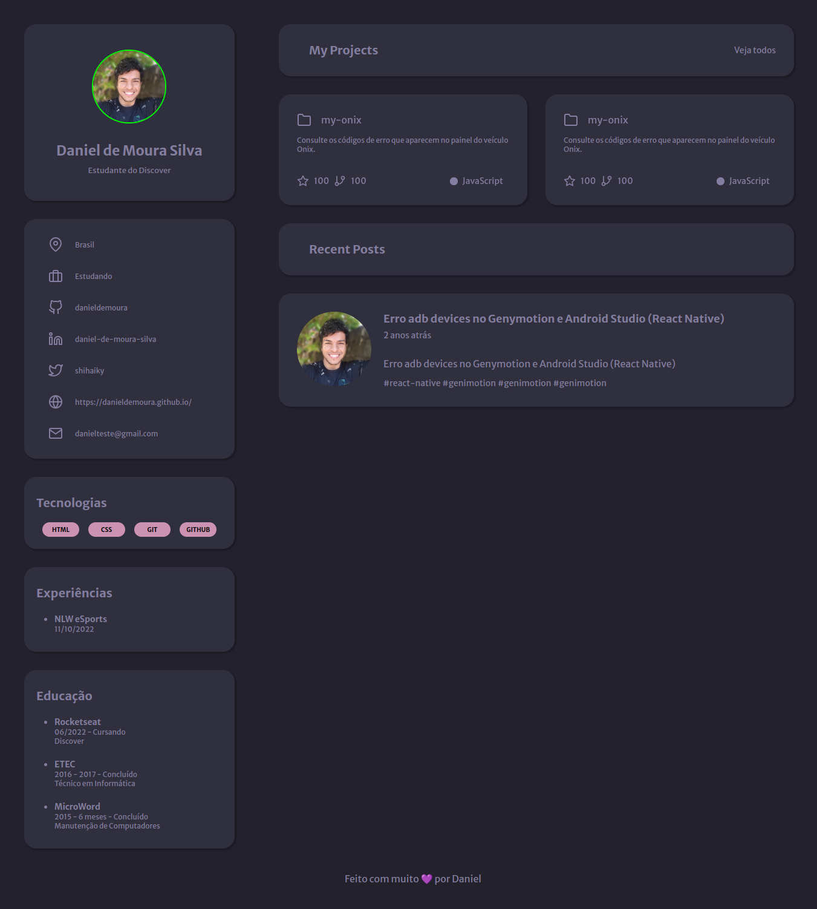

# Discover - Desafio "Portfolio"
> Esse projeto tem como objetivo a criação de uma página Web para que seja um portfolio e um currículo.

> ## 🔗 [Clique aqui para acessar o link do projeto](https://danieldemoura.github.io/Desafio-Portfolio/)

## 🛠️ **Tecnologias Utilizadas**
- HTML
- CSS  
- Figma

## ℹ️ **Informação Adicional**
O design desse projeto foi feito completamente com base no design final feito no Figma.

    Esse projeto foi costruído no mesmo dia 19/09/2022
